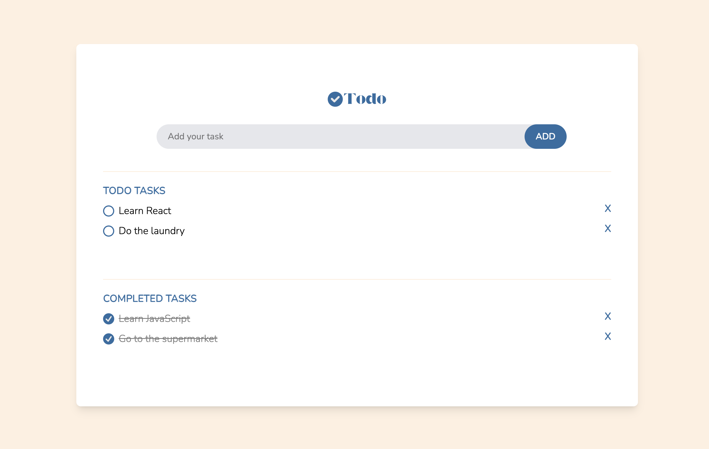

# Todo

## Overview:

A simple todo app that allows users to add, toggle, and delete their todos. Todos are categorised into active and completed sections.

## Features:

- Add new todos.
- Toggle todos between active and completed states.
- Delete todos.
- Persistent storage using localStorage.
- Responsive design for various screen sizes.

## Tech Stack:

- **Frontend:** HTML, Tailwind CSS, React, JavaScript.
- **State Management:** Redux Toolkit (Used to gain hands-on experience and improve proficiency with Redux best practices).
- **Storage:** localStorage.

## Screenshot:



## Sitemap:

- The application consists of a single page that consists of:

- A main page displaying the **todo list**
- Functionality to **add, mark as complete, and delete todos**

## Developer Installation Guide:

1. Clone the repository:

   ```
   git clone https://github.com/your-username/todo.git
   cd todo
   ```

2. Install dependencies:

   ```
   npm install
   ```

3. Start the development server:

   ```
   npm run dev
   ```

4. Open your browser and navigate to `http://localhost:5173/` (or the port specified in your setup).
